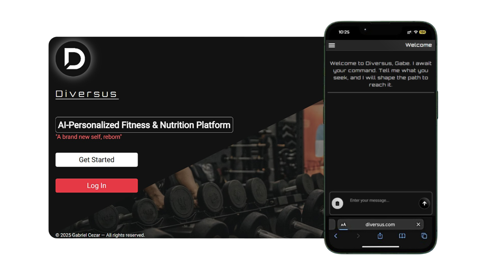

# Diversus
**Website**: https://diversus-psi.vercel.app/  

This website was made to assist people that wish to accomplish long or short term workout and diet goals. In a matter of minutes Diversus can shine a light in the end of the tunnel for users that want some solid guidelines in their active life and that is done by only talking with the AI and filling the main dashboard form with some basic answers.  

<div style='width:100%; display:flex; justify-content:center; align-items:center;'>
  
</div>

## How does it work
- In the home page, click in the `Get Started` to create an account.
- After registering yourself, log in.
- You will then land in the Diversus dashboard.
- You may ask anything, but specially about diets and workouts.
- As you ask about creating a plan, Diversus will automatically open a form asking some basic questions.
- Once you're done with all the answers, click `Generate` and **don't leave the conversation**.
- Now, Diversus will analyze your answers and tailor the perfect workout or diet plan for you.
- Then, when Diversus is done writing, you may save it in your **Plans tab** by clicking in the `Save plan` button.

## Other functionalities
- In the **Plans tab** you can view, edit, delete or set a plan as default.
- **Plans tab** will contain three main sections between diet and workout plans: 
  1. General Information, 
  2. Exercises/Meals Information.
  3. Details Information.
- As of now you can only edit the plans' general information.
- In the **Profile tab** you can add a picture photo and edit your first or last name.
- There is the ability for a user to manage its conversations by clicking in the `Manage` (or `Manage conversations`) button which will take the user to the manage conversations page and there the conversations can either be viewed or deleted.

## Code

- **Authentication:**  
  The auth was built on top of `NextAuth` and with `Zod` for form validation.   
  Essentialy the component in the file `login-form.tsx` will call the `authenticate` function through server actions and test the credentials against the user's hashed password stored in the database with `bcrypt.compare()`.  

  **Code is found on the paths:**  
    1. `@app/actions/credential-handler.ts`.
    2. `@app/ui/login-form.tsx`.
    3. `@app/actions/auth.ts`.
<br></br>
---

- **Signing up:**  
  The sign up logic uses **Zod** for form validation, hashing for the passwords and database query for inserting the user credentials into the users table.  
  The component in `get-started-form.tsx` will call the `signup` function through server actions, **Zod** will validate user input, the user password will be hashed with `bcrypt.hash()` and then the database will store the user credentials.

  **Code is found on the paths:**  
    1. `@app/ui/getstarted-form.tsx`.
    2. `@app/actions/auth.ts`.
<br></br>
---

- **AI Interaction:**  
  I used OpenAI's API and ChatGPT models to be Diversus.  
  After logging in successfully, you will be greeted by Diversus and will be able to talk with it.  
  
  > For your information a **conversation** is a chat created and saved in the database that the AI always knows about.  
  > **Main Call** is the `handleRequest()` function located on `@app/actions/chat.ts`

  The message workflow in the `input-form.tsx` works like this:  

  - User sends a message and executes `submitPrompt()`.
  - Chat bubbles are created for the user and the AI with `createChatBubble()`.
  - Interpreter AI checks if should return "suggest" or "null" (the "suggest" signal opens the diet/workout form automatically).
  - Then the main AI API is called.  
    **Main Call**:
    - In this call, Diversus will read the instructions provided and receive the conversation history by `getConversationHistory()` so far which is kept locally (and in the cloud if there is a conversation).
    - If this user prompt is coming from an existent conversation, execute `saveConversationData()` which saves the user message into the current conversation database table.
    - If there is no existent conversation, `getConversationContext()` will be called to return a valid conversation title or `false`. The AI weight the user question against the instructions and evaluates if its worth creating a title for this specific prompt.
    - If `getConversationContext()` returns a title: execute `createNewConversation()`, creating a brand new conversation and saving it along with the user message into the database.
    - If `getConversationContext()` returns `false`: skip to the title generation.
    - Finally, we get the response from a ChatGPT model and return a stream.
  - Returning to `submitPrompt()`, we decode and stream the AI response into the state `response` with its setter `setResponse`.
  > In `panel.tsx` we have a `useEffect()` hook to watch for `response` changes and feed its content to the AI's chat bubble in order to create the streamable text effect.
  - Then, we check if the Interpreter call returned a "suggest" signal so we can open the workout/diet form automatically for the user.
  - Now, at this point we should have the AI response fully generated and we need to check if its worth saving in the database. So we call another API to save the AI message.  
    **Save AI Message Call:**
    - Here we check if this call has been called with an existent conversation.
    - If not, we query the databse for the brand new conversation created in the **Main Call** and save the AI message there.
    - If there is, we use this existent conversation to save the AI message.
    - Finally this API will return the conversation id if the saving was successful or just a message otherwise.
  - Back to the `submitPrompt()` function, finally we return `data`.
  - If the previous API call returned a message, return nothing.
  - If the previsos API call returned an id, return that id as `data.url`.

  After receiving `data.url` as result of calling `submitPrompt()`, we set its content to `submitPromptData` which then triggers a `useEffect()` hook to navigate the user to the newly created conversation route and automatically open the diet/workout form.  

  **Code is found on the paths:**  
    1. `@app/ui/dashboard/ai-chat/input-form.tsx`.
    2. `@app/api/chat/save-ai-message/route.ts`.
    3. `@app/ui/dashboard/ai-chat/panel.tsx`.
    4. `@app/actions/frontend-ui/ai-chat.ts`.
    5. `@app/api/chat/interpreter/route.ts`.
    6. `@app/actions/chat.ts`.
  <br></br>
---

- **Filling up the diet/workout form:**  
  The diet/workout form is used to fill up user metadata and goals prior to calling Diversus so it can have some context on what to build.  
  I have the diet and workout form data stored in the path `@root/public/plan-metadata` which you can find all the data and types that's used to build the plans and feed the front-end form component.  
  To explain this section I will provide the diet form data and lecture on top of that, so feel free to explore the workout data part of it yourself.
  > Note that I have only provided the data that the diet form uses, the rest of it is kept under the path above.

  ```ts
  export const dietFormRawData = {
    id: uuid,
    plan_type: '',
    goal: '',
    gender: '',
    current_weight: '',
    height: '',
    age: 0,
    activity_level: '',
    number_of_meals: 0,
    meal_timing_hours: 0,
    duration_weeks: 0,
    want_supplements: false,
    daily_caloric_intake: 0,
    dietary_restrictions: [],
    user_notes: '',
    ...
  }
  ```
  - In the `chat-structure.tsx` component is where the raw diet data is fed into its state `dietFormData` which then is shared across all `ChatStructure` children components via **Context**.
  - Note that the id is fed by `v4 from uuid` upfront so we can use it in the chat bubbles.
  - I will also explain the `localMessages` state here since is where is firstly defined.  
    **Local Messages:**
    - Is the local copy of all messages from the user and the AI which is fed from the database when there is an existent conversation.
    - It receives important data other than the message content and role.
    - In the code provided below we keep the form data stored in the message object so its id can be accessed from the `panel.tsx` and provide the ability to save the plan itself and redirect the user to the saved plan.
    ```ts
    export type Message = {
      sent_date: string;
      message_content: string;
      conversation_id: string;
      role: 'user' | 'assistant';
      id: string;
      form_data?: dietFormDataType | workoutFormDataType | null;
      plan_saved: boolean;
    };
    ```
  Whenever the user fills the form up to the `user_notes` field, the next form section will then show the `Generate` button.  
  - **What happens when the `Generate` button is clicked:**
    - The `generatingPlan` loading state will be toggled to `true`.
    - In the `form-structure.tsx` we have the function `handleFormSubmission()` which is called by the `Generate` button.
    - The `generatePlan()` function is then called and expected to receive the full form data filled up by the AI as a return value.
    - Inside `generatePlan()` the code checks for missing fields and converts data from the form.
    - Then it will call the Interpreter API.  
      **Interpreter API call:**
      - The interpreter AI will receive the whole form data as a string.
      - It will read a big intruction string.
      - It will generate a new version of the form, but totally filled up.
      - Finally it will return the fresh filled form as `interpretation`.
    - Once the `generatePlan()` receives the data from the interpreter, it will return it.
    - In `handleFormSubmission()` we receive the data as `response` and set it to the form state `dietFormData`.
    - The `generatingPlan` loading state will be toggled to `false`.
    - Finally the workout/diet form is automatically closed.  
  - **Back to `input-form.tsx`:**
    - Now that the diet plan generation was completed, back in the `input-form.tsx` a `useEffect()` hook that watches over `generatingPlan` loading state triggers `executeSubmission()` function over a specific condition that only when satisfied, will call `submitPrompt()`, but now it will receive the filled up diet form data as an argument.
    - Ultimately, `submitPrompt()` will generate once more chat bubbles for the AI and the user like usual.
    - What changes now is that the AI chat bubble will be fed with the diet form data, giving the ability for the user to save and access the plan dynamically.
    - Later, the code feeds the diet form data into the main AI call.
    - Main call will create a conversation if there is no existent one yet.
    - Once the main call receives the diet form data, it will convert all that cryptic object-like information into readable markdown and stream it to the front-end.
    - The user may be redirected to the conversation if a brand new one got created.
  
    **Code is found on the paths:**  
      1. `@app/ui/dashboard/ai-chat/plan-form/form-structure.tsx`.
      2. `@app/ui/dashboard/ai-chat/chat-structure.tsx`.
      3. `@app/ui/dashboard/ai-chat/input-form.tsx`.
      4. `@app/api/chat/save-ai-message/route.ts`.
      5. `@app/actions/frontend-ui/ai-chat.ts`.
      6. `@app/api/chat/interpreter/route.ts`.
      7. `@root/public/plan-metadata`.
      8. `@app/lib/definitions.ts`.
      9. `@app/actions/chat.ts`.
  <br></br>
---

- **Profile picture logic:**  
I decided to touch on this because, I think is an important addition to the app and shows how I can handle image CRUD.  
Although I will focus on the picture side of the profile, the edit function works the same for the user's first and last name.  
The component in the `profile-card.tsx` file will execute the `editUserProfile()` function through server actions using `Zod` as the validation tool and update the desired fields in the database.  

  **For The Profile Picture:**  
  - I created a custom container element with the button `Choose file` that opens the hidden type file input through a `.getElementById()` document method.
  - There the user can upload a file, but it must be either `.jpeg`, `.jpg`, `.png` or `.webp`.
  - A preview of the image will promptly show for a valid image.
  - Once the `Edit` button is clicked or the form submitted, `editUserProfile()` will execute.
  - First thing to be checked is if there is an image file being uploaded.
    - If not, skip.
    - If so, we also check if the user has an existent picture already uploaded in the database.
      - If not, skip.
      - If so, we check if it is a duplicate. 
        - If it's a duplicate we skip.
        - If it's not a duplicate:
          - We delete the profile picture in the AWS S3 bucket through an API call.
          - We then delete the profile picture in the database.
    - Then we call the upload S3 API to upload the new profile picture to S3.
    - After we finally insert the new profile picture into the database.  
  
  **Code is found on the paths:**  
  1. `@app/ui/dashboard/profile/profile-card.tsx`.
  2. `@app/api/s3-delete/route.ts`.
  3. `@app/api/s3-upload/route.ts`.
  4. `@app/actions/profile.ts`.
  5. `@app/actions/schemas.ts`.
  <br></br>
---

- **Testing:**  
For testing I used **Jest** for unit-test and **Playwright** for end-to-end tests.  
All information related to that you can check in the path `@root/tests`.

